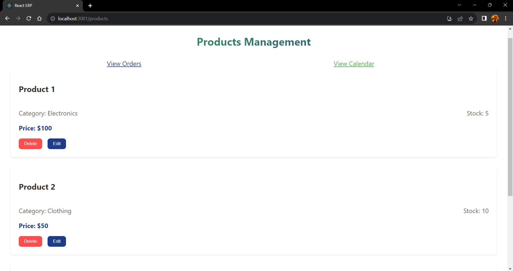

**Simplified React ERP**

This README document provides instructions for running and using the front-end application. It includes details on setup, installation, and usage, along with screenshots demonstrating the functionality of the website.
Table of Contents

   # Introduction
   # Installation
   # Usage
   # Screenshots

**Introduction**

This is a web-based ERP (Enterprise Resource Planning) system designed to streamline business operations. It offers features such as managing products, viewing orders, and accessing a calendar for scheduling.
Installation

To install and run the front-end application, follow these steps:

    Clone the repository to your local machine:

    bash

git clone https://github.com/saiprasadreddy33/ReactERP.git

Navigate to the project directory:

bash

cd your-repository

Install dependencies using npm or yarn:

bash

    npm install
    # or
    yarn install

**Usage**

Once the installation is complete, you can start the development server and interact with the website. Follow these steps:

    Start the development server:

    bash

    npm start
    # or
    yarn start

    Open your web browser and navigate to http://localhost:3000 to access the front-end application.

    Explore the various features of the ERP system, such as managing products, viewing orders, and accessing the calendar.

**Screenshots_**

Below are some screenshots demonstrating the functionality of the front-end application:

